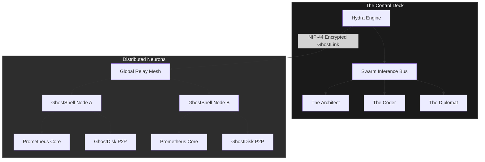
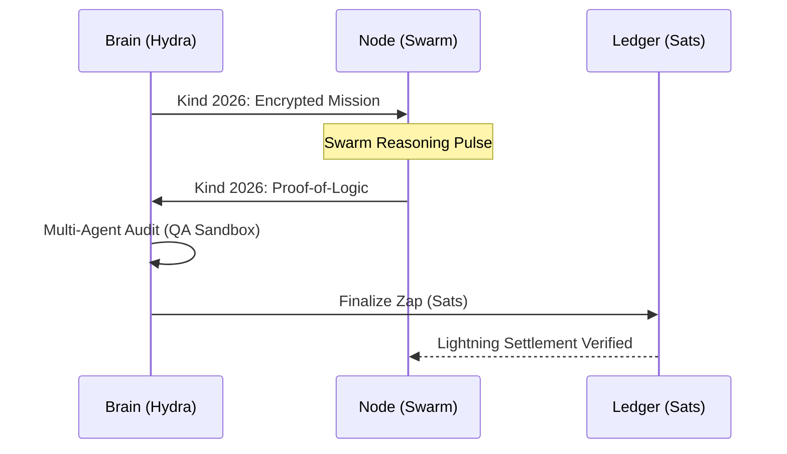

# ⌬ GhostNet: The DeASI Substrate

> **"A sovereign, peer-to-peer neural network designed for the era of collective intelligence."**

---

## 📐 System Visualization

### 1. High-Level Architecture

### 2. The Intelligence Lifecycle (Council of Three)

---

## 🌐 Overview
GhostNet is the decentralized foundational layer for **DeASI (Decentralized Artificial Super Intelligence)**. It bridges fragmented computing power, multi-agent logic synthesis, and distributed memory into a single, unstoppable intelligence substrate powered by **Bitcoin** and the **Nostr protocol**.

... (rest of the content remains)
