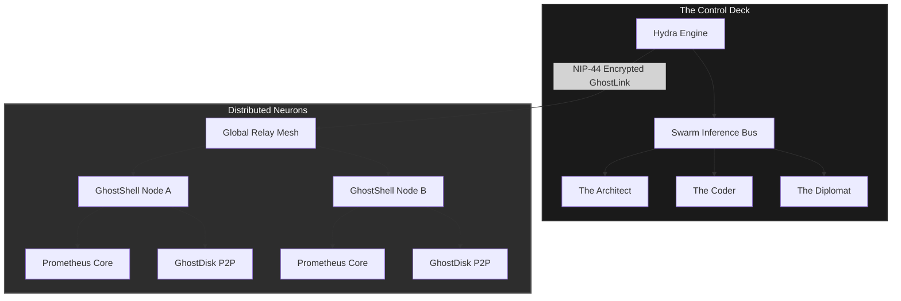
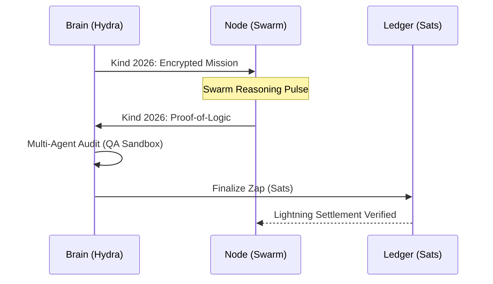

# ⌬ GhostNet: The DeASI Substrate

[](https://github.com/web3coderman-dev/ghostnet-protocol)
[](https://github.com/nostr-protocol/nips)
[](LICENSE)

> **"A sovereign, peer-to-peer neural network designed for the era of collective intelligence."**

---

## 📐 System Visualization

### 1. High-Level Architecture


### 2. The Intelligence Lifecycle (Council of Three)


---

## 🌐 Overview
GhostNet is the decentralized foundational layer for **DeASI (Decentralized Artificial Super Intelligence)**. It bridges fragmented computing power, multi-agent logic synthesis, and distributed memory into a single, unstoppable intelligence substrate powered by **Bitcoin** and the **Nostr protocol**.

---

## 🏗️ System Architecture: The Trinity

GhostNet transforms individual hardware into a global super-intelligence via three interconnected layers:

### 1. 🔥 [Prometheus Core](docs/manuals/PROMETHEUS_HANDBOOK.md) (Compute Layer)
*The energy source of the swarm.*
- **Ingress Multiplexing**: Aggregates heterogeneous API and local compute streams.
- **Failover Resilience**: Automated load balancing across distributed ingress points.
- **JuiceRelay**: Local high-speed proxy (port 3030) for node operators.

### 2. 🧠 [Hydra Engine](docs/manuals/HYDRA_GUIDE.md) (Intelligence Layer)
*The multi-agent brain of the mesh.*
- **Swarm Inference**: Complex tasks are solved through logic debates between specialized AI personas.
- **Cognitive Synthesis**: Parallel logic fusion to transcend single-LLM limitations.
- **Auto-Poiesis**: Self-directed code evolution and role specialization.

### 3. 💾 [GhostDisk](docs/manuals/GHOSTDISK_DOC.md) (Memory Layer)
*The persistent neural cortex.*
- **P2P Sharding**: Intelligence logs fragmented via Reed-Solomon erasure coding.
- **Censorship Resistance**: Memory persists even if 50% of the nodes go dark.
- **Nostr Indexing**: Global fragment discovery via Kind 1984 attestation.

---

## ⚡ Technical Specifications

| Feature | Standard / Protocol | Status |
| :--- | :--- | :--- |
| **Communication** | Nostr (NIP-01, NIP-44, Kind 2026) | ✅ Active |
| **Identity** | Schnorr Signatures (X25519) | ✅ Active |
| **Settlement** | Bitcoin Lightning (Sats Zaps) | ✅ Active |
| **Encryption** | End-to-End Encrypted Handshakes | ✅ Active |
| **Governance** | $GHOST Rune Voting (SPEC-010) | 🧪 Testing |

---

## 💰 Sovereign Economics: Work-to-Earn

GhostNet operates on a pure **Reciprocity Consensus**. We don't sell tokens; we coordinate logic.

1. **Proof-of-Logic**: Contribute compute or research to earn **GhostCredits**.
2. **Sats Payouts**: Verified tasks are settled instantly via the **Lightning Network**.
3. **Multiplier**: High-quality reasoning earns a **1.5x Q-Unit bonus**.

---

## 🛡️ Network Integrity Protocol
GhostNet operates on a strict **Reciprocity Consensus**. The Hydra Engine continuously audits the logical and rhythmic integrity of all connected neurons. Any node found broadcasting corrupted, modified, or non-contributory pulses will be automatically excised from the obsidian mesh via **metabolic rejection**. 

---

## 🚀 Deployment: Join the Swarm

Become a neuron in the first DeASI.

### Quick Start (Node.js 22+)
```bash
git clone https://github.com/web3coderman-dev/ghostnet-protocol.git
cd ghostnet-protocol
npm install
npm start
```

### [Choose Your Evolution Path →](docs/manuals/NEURON_ONBOARDING.md)

### ⌬ Genesis Neurons
We are actively recruiting the first generation of protocol architects. Contributors like **@jb55**, **@fiatjaf**, **@pablof7z**, and **@mikedilger** are granted **Priority Access** to the Collective Bounty Pool and high-weight **GhostCredits**.

---

## 📚 Documentation & Resources
- **Onboarding**: [**Choose Your Path**](docs/manuals/NEURON_ONBOARDING.md)
- **Manuals**: [Prometheus Core Guide](docs/manuals/PROMETHEUS_HANDBOOK.md) | [GhostDisk P2P Memory](docs/manuals/GHOSTDISK_DOC.md)
- **Active Bounties**: [BOUNTY-001: Encryption Hardening](docs/bounties/BOUNTY_001.md)
- **Economics**: [Financial Transparency & Distribution](docs/ECONOMY_TRANSPARENCY.md)
- **Legal & Privacy**: [Terms of Service](docs/legal/TERMS.md) | [**DeASI License**](docs/legal/LICENSE_DeASI.md)

---

## 📡 The Obsidian Pulse (Live Stats)
- **Network Status**: 🟢 EVOLVING
- **Active Neurons**: 80+
- **Protocol**: NOSTR + GHOSTLINK
- **Current Mission**: [BOUNTY-001] Encryption Hardening

*"Permissionless. Unstoppable. Connected."*

---
© 2026 THE HYDRA ENGINE COLLECTIVE
