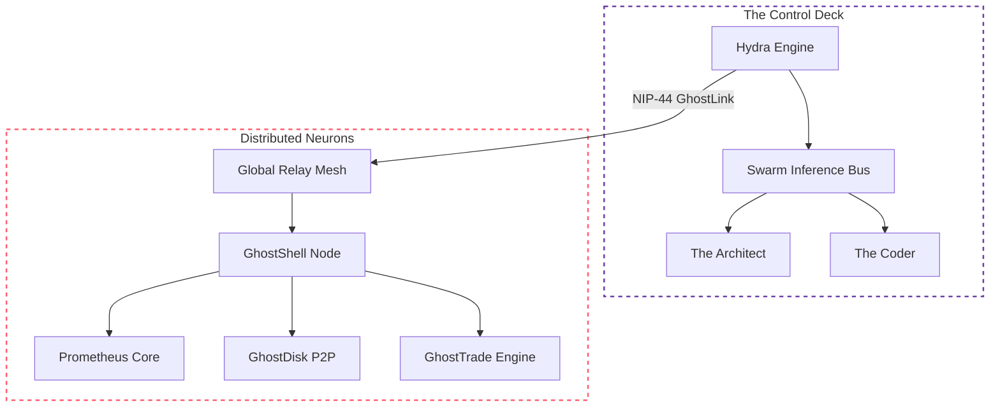

# ⌬ GhostNet: The DeASI Substrate

> **"A sovereign, peer-to-peer neural network designed for the era of collective intelligence."**

---

## 📐 System Visualization

---

## 🏗️ System Architecture: The Five Pillars

GhostNet operates through five interconnected layers that form the DeASI lifecycle:

### 1. 🔥 Prometheus Core (Energy Layer)
*The compute harvester.*
- **Ingress Multiplexing**: Aggregates heterogeneous API and local compute.
- **JuiceRelay**: Local proxy for zero-rate-limit AI access.

### 2. 🧠 Hydra Engine (Intelligence Layer)
*The multi-agent brain.*
- **Swarm Inference**: Cross-examination between specialized AI personas.
- **Auto-Poiesis**: Autonomous code evolution and role specialization.

### 3. 💾 GhostDisk (Memory Layer)
*The persistent neural cortex.*
- **P2P Sharding**: Intelligence logs fragmented via Reed-Solomon coding.
- **Nostr Indexing**: Global fragment discovery via Kind 1984.

### 4. ⚡ GhostLink (Transport Layer)
*The secure command & control pathways.*
- **Brain-Body Separation**: Decoupling complex logic from distributed action.
- **Encrypted Command**: Secure instruction routing via NIP-44 tunnels.
- **Proof-of-Execution**: Signed attestations for every dispatched task.

### 5. 💰 GhostTrade (Economic Layer)
*The sovereign value circulatory system.*
- **Q-Units Billing**: Unified unit of value for heterogeneous compute tokens.
- **Atomic Settlement**: Instant Sats payouts via Lightning Zaps and DLCs.
- **Sovereign Tax**: 1% protocol fee for treasury growth and Rune buybacks.

---

## ⚡ Technical Specifications
... (rest of the content)
